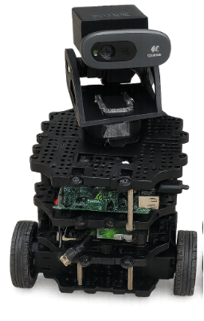

# RADAR — Remote Autonomous Doctor Assistance Robot

RADAR (Remote Autonomous Doctor Assistance Robot) is a **ROS 2–based medical telepresence robotic system** designed to enable remote clinician interaction, real-time robot control, live video streaming, and patient vital sign monitoring in environments where physical presence is limited.

The system was developed as a **complete, functional robotic platform** emphasizing modularity, low-cost hardware, and reliable remote operation.

<p align="center">
  
</p>

---

## 🚑 Motivation & Problem Statement

Access to medical personnel can be limited in remote, hazardous, or high-risk environments. RADAR addresses this challenge by providing a mobile telepresence robot that allows clinicians to:

- Remotely navigate a physical environment  
- Observe patients through live video  
- Monitor basic physiological data in real time  

The platform is designed for **research, prototyping, and educational use**, with a strong emphasis on extensibility.

---

## ✨ System Capabilities

- Real-time joystick-based teleoperation  
- Live camera streaming with pan–tilt control  
- Onboard vital sign monitoring (pulse & SpO₂)  
- Modular ROS 2 node-based architecture  
- Designed for rapid prototyping and extension  

---

## 🧱 System Architecture

RADAR is implemented as a set of **loosely coupled ROS 2 nodes**, enabling clean separation of perception, control, and sensing:

- **Teleoperation Node**  
  Reads joystick input and publishes velocity commands  

- **Base Controller Node**  
  Drives the mobile robot via `/cmd_vel`  

- **Camera Stream Node**  
  Publishes live video frames from the onboard camera  

- **Pan–Tilt Node**  
  Controls servo-driven camera orientation  

- **Vitals Node (MAX30102)**  
  Reads and publishes pulse and SpO₂ data  

This architecture allows individual subsystems to be modified or replaced without affecting the overall system.

---

## 🔌 Hardware Components

- Mobile robot base (TurtleBot-class platform)  
- Raspberry Pi  
- USB camera  
- Pan–tilt servo module  
- MAX30102 pulse oximeter  
- Joystick controller  

---

## 💻 Software Stack

- Ubuntu Linux  
- ROS 2 (Humble)  
- Python and C++  
- OpenCV  
- Qt (GUI development)  

---

## 📂 Repository Structure
RADAR-Telepresence-Robot/

├── src/ # ROS 2 packages

├── launch/ # Launch files

├── config/ # Configuration files

├── assets/ # Images and videos

└── README.md

---

## ⚙️ Installation & Build

### Prerequisites
- Ubuntu 24.04 
- ROS 2 Jazzy  
- Python 3  
- colcon  

### Setup
```bash
# Create workspace
mkdir -p ~/radar_ws/src
cd ~/radar_ws/src

# Clone repository
git clone https://github.com/yusufdxb/RADAR-Telepresence-Robot.git

# Build workspace
cd ..
colcon build
source install/setup.bash
```

---

## ▶️ Usage

The RADAR system is composed of multiple ROS 2 nodes that together enable remote operation and monitoring of the robot. These nodes handle mobile base teleoperation, live camera streaming, pan–tilt camera control, and physiological vital sign sensing.

System components are designed to run concurrently and communicate through standard ROS 2 topics. Launch files located in the `launch/` directory are used to coordinate the startup of all required nodes for full system operation.

---

## 📊 Project Status

The RADAR system is functionally complete. Core capabilities including joystick-based teleoperation, live video streaming, pan–tilt camera control, and onboard vital sign sensing have been implemented and validated.

---

## 🔮 Future Extensions

Possible future extensions of RADAR include the integration of autonomous navigation and obstacle avoidance, expansion of the graphical user interface, incorporation of additional sensing modalities for redundancy, and support for remote networking over wide-area connections.

These extensions can be added without restructuring the existing system due to the modular ROS 2 architecture.

---

## 📫 Contact

For questions, collaboration, or system extensions, please reach out through GitHub.


The project serves as a stable baseline platform for experimentation, system integration, and future research extensions.

