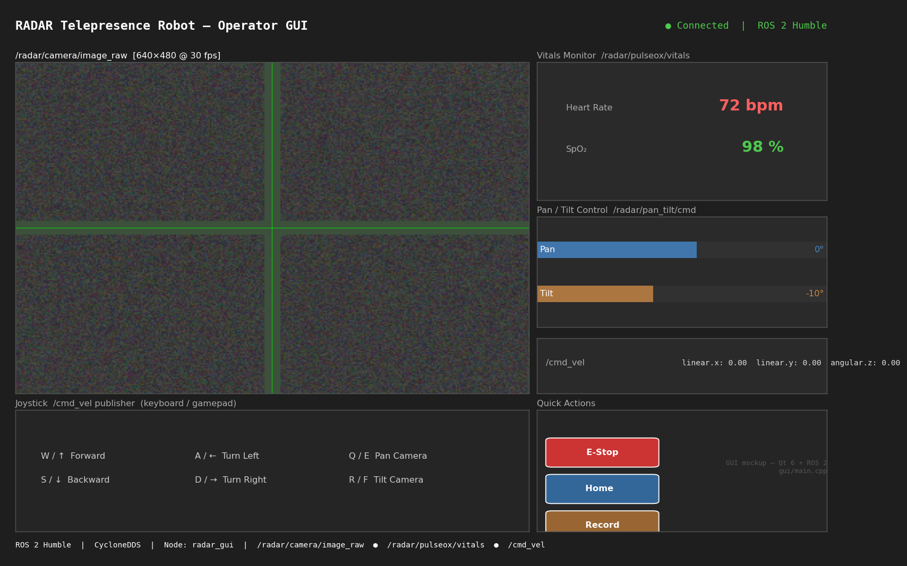

<p align="center">
  
</p>

<h1 align="center">RADAR — Remote Autonomous Doctor Assistance Robot</h1>

<p align="center">
  <em>Bringing clinical presence anywhere, in real time.</em>
</p>

<p align="center">
  
  
  
  
  
  
</p>

---

## What is RADAR?

**RADAR** is a ROS 2 medical telepresence robot designed for environments where physical access to healthcare is constrained — remote sites, quarantine zones, or high-risk clinical settings. The goal: a clinician controls the robot remotely, orients a live camera, and monitors a patient's pulse and blood oxygen in real time through a single Qt-based interface.

The hardware prototype validated teleoperation, camera streaming, servo-driven pan-tilt, and MAX30102 vital sign monitoring. The system is built around a **modular, node-based ROS 2 architecture** so each subsystem can be upgraded or replaced independently.

---

## Features

| Capability | Details |
|---|---|
| **Joystick Teleoperation** | Real-time velocity commands via `/cmd_vel` |
| **Live Video Streaming** | USB camera feed published as ROS 2 image topics |
| **Pan–Tilt Camera Control** | Servo-driven 2-axis camera orientation |
| **Vital Sign Monitoring** | Pulse rate & SpO₂ via MAX30102 sensor |
| **Operator GUI** | Unified Qt 6 control panel for all subsystems |
| **Modular Architecture** | Loosely coupled ROS 2 nodes — swap any component independently |

---

## System Architecture

```
┌──────────────────────────────────────────────────────┐
│                    OPERATOR GUI (Qt 6)                │
│        Teleoperation │ Video Feed │ Vitals Display    │
└────────────┬─────────┴─────┬──────┴──────────────────┘
             │               │
    ┌────────▼────────┐  ┌───▼──────────────────────┐
    │ Teleop Node     │  │   Camera Stream Node      │
    │ /joy → /cmd_vel │  │   USB Cam → Image Topic   │
    └────────┬────────┘  └───────────────────────────┘
             │
    ┌────────▼────────┐  ┌───────────────────────────┐
    │ Base Controller │  │   Pan–Tilt Node           │
    │ Mobile Platform │  │   Servo 2-Axis Control    │
    └─────────────────┘  └───────────────────────────┘
                         ┌───────────────────────────┐
                         │   Vitals Node (MAX30102)  │
                         │   Pulse + SpO₂ → Topic    │
                         └───────────────────────────┘
```

All nodes communicate over standard ROS 2 topics — no tight coupling, no monolithic code.

---

## Hardware

| Component | Role |
|---|---|
| TurtleBot-class Mobile Base | Ground locomotion platform |
| Raspberry Pi | Onboard compute |
| USB Camera | Live video capture |
| Pan–Tilt Servo Module | Camera orientation control |
| MAX30102 Sensor | Pulse oximetry (SpO₂ + heart rate) |
| Joystick Controller | Operator teleoperation input |
| Custom 3D-Printed Mount | Pan-tilt camera bracket |

---

## Software Stack

| Layer | Technology |
|---|---|
| OS | Ubuntu 24.04 |
| Robotics Framework | ROS 2 Jazzy |
| Languages | Python 3, C++ |
| Vision | OpenCV |
| GUI | Qt 6 / PyQt6 |
| Sensing | smbus2, max30102 |
| Serial | pyserial |

---

## GUI — Operator Interface

The RADAR operator GUI is built with **Qt 6** and gives clinicians a single unified interface to control the robot and monitor the patient — without touching a terminal.

**Panels include:**
- Live video feed with pan–tilt controls
- Joystick teleoperation overlay
- Real-time vitals (heart rate & SpO₂)
- System status indicators

<!-- Add gui_demo.png to assets/ to enable this image -->
<!--  -->

> **GUI screenshot:** Add `assets/gui_demo.png` to display the Qt 6 operator interface here.

---

## Repository Structure

```
RADAR-Telepresence-Robot/
├── src/              # ROS 2 packages (nodes)
├── launch/           # Launch files
├── config/           # Parameter and config files
├── gui/              # Qt 6 operator interface (C++)
├── assets/           # Images and demo media
├── docs/             # Documentation
├── requirements.txt  # Python dependencies
├── SETUP.md          # Detailed setup guide
└── README.md
```

---

## Installation

> For the full setup guide including ROS 2 installation and hardware configuration, see [SETUP.md](SETUP.md).

### Prerequisites

- Ubuntu 24.04
- ROS 2 Jazzy
- Python 3.10+
- colcon build tools

### Quick Start

```bash
# 1. Create workspace
mkdir -p ~/radar_ws/src && cd ~/radar_ws/src

# 2. Clone the repository
git clone https://github.com/yusufdxb/RADAR-Telepresence-Robot.git

# 3. Install Python dependencies
pip install -r RADAR-Telepresence-Robot/requirements.txt

# 4. Build
cd ~/radar_ws
colcon build

# 5. Source and launch
source install/setup.bash
ros2 launch launch/radar_bringup.launch.py
```

---

## ROS 2 Topics

| Topic | Type | Direction | Description |
|-------|------|-----------|-------------|
| `/cmd_vel` | `geometry_msgs/Twist` | GUI → base | Teleoperation velocity |
| `/joy` | `sensor_msgs/Joy` | joystick → teleop node | Raw joystick input |
| `/camera/image_raw` | `sensor_msgs/Image` | camera node → GUI | Live video feed |
| `/pan_tilt/cmd` | `std_msgs/Float32MultiArray` | GUI → pan-tilt node | Servo angle commands |
| `/vitals/pulse` | `std_msgs/Float32` | vitals node → GUI | Heart rate (BPM) |
| `/vitals/spo2` | `std_msgs/Float32` | vitals node → GUI | Blood oxygen (%) |

## Usage

Each subsystem has its own ROS 2 node and can be launched individually or together via the launch files in `launch/`.

```bash
# Launch full system
ros2 launch launch/radar_bringup.launch.py

# Or launch individual nodes
ros2 run radar_teleop teleop_node
ros2 run radar_camera camera_stream_node
ros2 run radar_vitals vitals_node
```

All nodes communicate over standard ROS 2 topics and can be monitored with `ros2 topic list` and `rqt`.

---

## Project Status

Hardware access has ended. The prototype was built and tested; the codebase reflects the full intended design.

**Validated on hardware:**
- [x] Joystick teleoperation (joystick → `/cmd_vel` → mobile base)
- [x] Live video streaming (USB camera → ROS 2 image topic)
- [x] Pan–tilt servo control (joystick axes → GPIO-driven servos via gpiozero)
- [x] Vital sign monitoring (MAX30102 I2C driver — HR and SpO₂ peak detection)

**Implemented, not hardware-tested:**
- [x] Qt 6 operator GUI (rclcpp spin thread, live video panel, vitals display, pan-tilt sliders)

**Not implemented:**
- [ ] Two-way audio
- [ ] Autonomous navigation (Nav2)
- [ ] Wide-area network streaming (WebRTC / RTSP)

---

## Future Work

The modular ROS 2 architecture makes RADAR straightforward to extend:

- **Autonomous navigation** — drop in a Nav2 stack without touching existing nodes
- **Expanded sensing** — thermal camera, additional vitals sensors
- **Wide-area networking** — VPN or WebRTC for operation beyond the local network
- **AI-assisted triage** — integrate a vision model for automated patient assessment

---

## License

This project is licensed under the MIT License. See [LICENSE](LICENSE) for details.

---

## Contact

Built by [@yusufdxb](https://github.com/yusufdxb) — open to collaboration, questions, and extensions via GitHub Issues.
