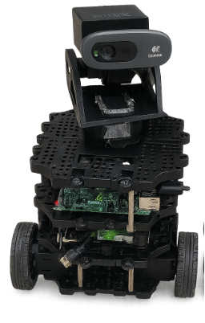
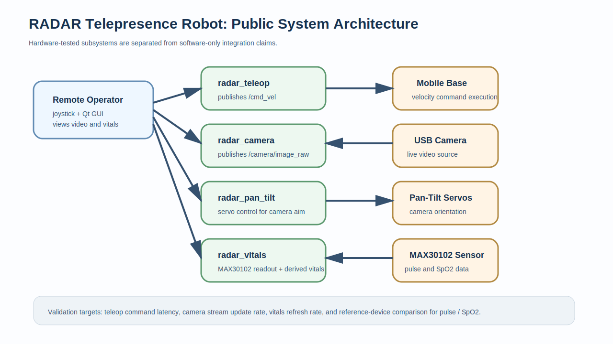
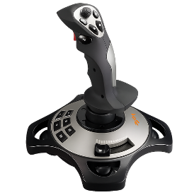

<p align="center">
  
</p>

# RADAR Telepresence Robot

> ROS 2 telepresence prototype for remote clinical interaction.

**Platform:** Raspberry Pi + mobile base + USB camera + pan-tilt servos + MAX30102  
**Status:** prototype completed; hardware access ended  
**Public repo status:** hardware-tested subsystems are documented separately from implemented-but-not-hardware-validated software

## What This Project Is

RADAR is a modular ROS 2 telepresence robot intended for constrained-care environments where a remote operator needs mobility, live video, camera orientation control, and patient vitals in one system.

The strongest public signal in this repo is not novelty marketing. It is integration:
- teleoperation over ROS 2 topics
- live camera streaming
- servo-driven pan-tilt control
- MAX30102 pulse and SpO2 sensing
- a dedicated Qt operator interface

## What Was Actually Validated

### Hardware-tested on the prototype
- joystick teleoperation to robot velocity commands
- USB camera image publishing
- pan-tilt servo actuation through ROS 2 nodes
- pulse oximeter data acquisition and derived vitals publishing

### Implemented in the repo, but not hardware-revalidated after access ended
- Qt operator GUI in `gui/main.cpp`
- full integrated bringup from the public software stack

That distinction is intentional. The repo should not claim more validation than it has.

## Public Architecture



More detail: [HARDWARE.md](HARDWARE.md), [TESTING.md](TESTING.md), [VALIDATION.md](VALIDATION.md)

## Existing Hardware Assets

<p align="center">
  
  
  
</p>

These images are now paired with a concrete demo and validation plan instead of being left as disconnected media.

## Repository Layout

| Path | Purpose |
|---|---|
| `src/radar_teleop` | joystick and teleop node |
| `src/radar_camera` | camera publisher |
| `src/radar_pan_tilt` | pan-tilt control nodes |
| `src/radar_vitals` | pulse oximeter acquisition and vitals publishing |
| `src/radar_bringup` | launch package |
| `gui/` | Qt 6 operator interface |
| `config/` | subsystem configuration |
| `assets/` | hardware images and project media |

## ROS 2 Packages

| Package | Role |
|---|---|
| `radar_teleop` | converts operator input into motion commands |
| `radar_camera` | publishes live video from the onboard camera |
| `radar_pan_tilt` | handles servo orientation control |
| `radar_vitals` | reads MAX30102 and publishes raw/vitals topics |
| `radar_bringup` | launches the software stack |

## Build

```bash
mkdir -p ~/radar_ws/src
cd ~/radar_ws/src
git clone https://github.com/yusufdxb/RADAR-Telepresence-Robot.git
cd ~/radar_ws
source /opt/ros/jazzy/setup.bash
pip install -r src/RADAR-Telepresence-Robot/requirements.txt
colcon build --symlink-install
source install/setup.bash
```

## Run

The active launch file in this repository is:

```bash
ros2 launch radar_bringup radar_system.launch.py
```

Representative individual nodes:

```bash
ros2 run radar_teleop teleop_node
ros2 run radar_camera camera_node
ros2 run radar_pan_tilt pan_tilt_node
ros2 run radar_vitals pulse_ox_node
```

These commands match the public package layout more closely than the older top-level launch examples.

## Topics

| Topic | Purpose |
|---|---|
| `/cmd_vel` | mobile base velocity command |
| `/camera/image_raw` | live video stream |
| `/radar/pulseox/raw` | raw sensor values |
| `/radar/pulseox/vitals` | processed heart rate and SpO2 estimates |
| `/pan_tilt/cmd` | servo command topic |

## Demo And Validation Scaffolding

- [DEMO.md](DEMO.md) defines a recruiter-friendly 90-second demo sequence.
- [VALIDATION.md](VALIDATION.md) defines the specific latency and reference-device checks still worth publishing.

## Why This Repo Is Stronger Than Average

- It combines UI, sensing, teleop, and hardware I/O instead of stopping at a single ROS 2 node.
- The vitals path includes actual device-level code instead of a placeholder sensor wrapper.
- The public repo distinguishes between implemented scope and validated scope, which makes it more credible under employer review.

## Current Gaps

The highest-value additions still missing are:
- one end-to-end demo video
- GUI screenshots or screen recording
- quantitative latency notes for video, teleop, and vitals refresh
- comparison of vitals output against a reference device

## License

MIT License. See [LICENSE](LICENSE).

## Contact

Built by [@yusufdxb](https://github.com/yusufdxb)
